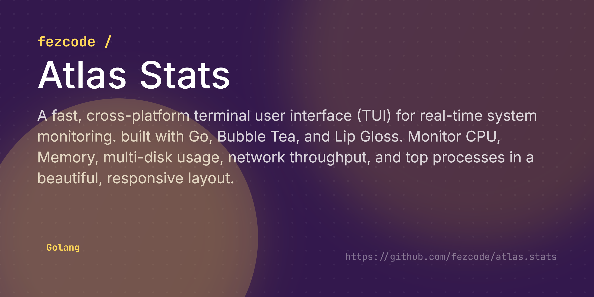

# Atlas Stats



**atlas.stats** is a fast, interactive terminal user interface (TUI) for real-time system monitoring. It provides a comprehensive view of your machine's health, including CPU, Memory, Disk, and Network activity in a clean, responsive interface.


## ✨ Features

- 📊 **Real-time Monitoring:** Instant updates for CPU usage and Memory consumption.
- 💾 **Multi-Disk Support:** Dynamic row for all available physical disks with usage indicators.
- 🌐 **Network Activity:** Live tracking of total Sent/Received data and current throughput rate.
- 🔝 **Process Tables:** Lists top 5 processes by CPU, Memory, Disk I/O, and Network Connections.
- 📱 **Responsive UI:** Adaptive layout that stacks components on narrow terminals and wraps disk/process boxes.
- ⌨️ **Navigable View:** Vertical scrolling support for small terminal windows.
- 📦 **Cross-Platform:** Binaries available for Windows, Linux, and macOS (AMD64, ARM64).

## 🚀 Installation

### From Source
```bash
git clone https://github.com/fezcode/atlas.stats
cd atlas.stats
go build -o atlas-stats .
```

## ⌨️ Usage

Simply run the binary to start monitoring:

```bash
./atlas-stats
```

## 🕹️ Controls

| Key | Action |
|-----|--------|
| `↑/↓` or `k/j` | Scroll view (when terminal is small) |
| `q` | Quit Atlas Stats |
| `Ctrl+C` | Force quit |

## 🏗️ Building for all platforms

The project includes a Go-based build script to generate binaries for all platforms:

```bash
go run scripts/build.go
```
Binaries will be placed in the `build/` directory.

## 📄 License
MIT License - see [LICENSE](LICENSE) for details.

